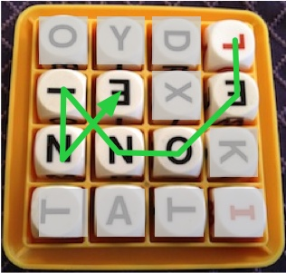

# Boggle solver HOWTO

[Boggle](https://en.wikipedia.org/wiki/Boggle) is a word game
invented in 1972. Players compete to see how many words they can 
form from the letters displayed on the top of 16 dice in a 4x4 
pattern. Variations with 3x3 ("Boggle junior"), 5x5, and 6x6 
("Super Big Boggle") grids exist, 
but we will build a solver for the original 4x4 version sometimes 
called "Classic Boggle".  


Our solver will make one simplification:  Modern Boggle dice 
include one face with the letter pair "QU".  Like earlier Boggle 
games, we will treat "Q" as an ordinary letter. 

## Interaction

Input to our Boggle solver will a sequence of 16 letters, which we 
will treat as four rows of four letters.  The output will be a list 
of words that can be formed from those letters according to Boggle 
rules, and a score.  The interaction will look like this: 

```commandline
Boggle board letters (or 'return' to exit)> oydliexennoktati
['ANENT', 'ANNEX', 'ANT', 'ANTI', 'ATONE', 'DEN', 'DENT', 'DYE', 
'EON', 'IKON', 'INANE', 'INN', 'INTO', 'ION', 'IOTA', 'KIT', 'LED', 
'LEONINE', 'NATION', 'NEON', 'NINE', 'NOEL', 'NOT', 'OAT', 'ONE', 
'OXEN', 'TAN', 'TANNED', 'TAT', 'TIKE', 'TOE', 'TOED', 'TOKE', 'TON',
'TONE', 'YEN', 'YIN']
49 points
```

Boggle rules allow a word to be formed by any path through the grid, 
including diagonal as well as horizontal and vertical moves, but 
each die may be used only once in each word.  For example, here is 
how the word "LEONINE" is found in the play above: 



In addition to the textual interaction, our Boggle solver will 
display its progress graphically.  


## Two-stage project

This project has several moving parts, so we will complete it in two 
stages.  The first stage will mainly concern quickly determining 
whether a sequence of characters is a word, or potentially the first 
part of a word (a _prefix_), or whether no word can be created by 
extending that sequence of characters.  In addition we will build 
some other support functions for the Boggle solver. 

In the second stage, we will create the actual Boggle solver,
using a recursive depth-first search.  This will be similar to the 
search we used to fill cavern chambers with water, but with some 
extra bookkeeping because a single die may be used only once in a 
single word but multiple times to find different words.

## Stage 1:  Quickly searching a word list

Our main objective in the first stage of the project is to very 
quickly determine whether a sequence of letters like _ANT_ is a word 
or a prefix of a word.  As we have before, we will base our 
judgments on a provided word list, which we will keep in
`data/dict.txt`.  Unlike prior projects, though, we will be looking 
up _many_ strings in the same word list.  Instead of checking words 
as we read the word list, we will read it once and store it in 
memory to use many times.

### Getting a start

We will start in the usual way, creating a program file called 
`boggler.py`.  

```python
"""Boggler:  Boggle game solver. CS 210, Fall 2022.
Your name here.
Credits: TBD
"""
import doctest

def main():
    pass

if __name__ == "__main__":
    doctest.testmod()
    print("Doctests complete")
    main()
```

Again we will need access to an external word list file, and we 
don't want to hard-code the file path in our program, so we'll 
create a separate `config.py` file with the file path: 

```python
""""Configuration of Boggle player"""

# List of words to search for
DICT_PATH = "data/dict.txt"
```

Import `config` in `boggler.py` the same way we have imported 
configuration paths in prior projects. 

Internally the word list will be a list of strings.  We will create 
a function to obtain that list of strings from an external word list 
file like `dict.txt`. 

### Reading the word list

```python
def read_dict(path: str) -> list[str]:
    """Returns ordered list of valid, normalized words from dictionary.

    >>> read_dict("data/shortdict.txt")
    ['ALPHA', 'BETA', 'DELTA', 'GAMMA', 'OMEGA']
    """
```

There are a few things to notice about `read_dict`.  Here is the 
actual content of `shortdict.txt`:

```commandline
BETA
alpha
omega
big-time
dEltA
gamma
is
```

### Filtering the word list

The list of words returned by `read_dict` is _filtered_ to contain 
only words that are valid in Boggle:  They must contain at least 
three letters, and they must contain only letters.  For this we 
will write a short supporting function `allowed`:

```python
def allowed(s: str) -> bool:
    """Is s a legal Boggle word?

    >>> allowed("am")  ## Too short
    False

    >>> allowed("de novo")  ## Non-alphabetic
    False

    >>> allowed("about-face")  ## Non-alphabetic
    False
    """
```

Although we are solving only the classic version of Boggle for now, 
we want to avoid _magic numbers_ that would make it harder to adapt 
our program to other versions in the future.  Therefor the our 
function `allowed` should refer to a _symbolic constant_ `MIN_WORD` 
for the minimum allowed length of a Boggle word.  We will place the 
definition of `MIN_WORD` near the beginning of the program file, 
just after the `import`s.  

```python
# Boggle rules
MIN_WORD = 3   # A word must be at least 3 characters to count
```

To check that a word contains only letters, we can use the string 
method `isalpha`, e.g., `s.isalpha()`.  

If `read_dict` includes only alphabetic strings of at least 3 
characters, it will exclude "is" and "big-time" from `shortdict.txt`. 

### Normalizing the word list

We have seen _normalization_ before, when we searched for anagrams 
in the jumbler project.  Normalization for Boggle is simpler --- we 
just need to decide whether to store words in upper-case or 
lower-case and use that normalization consistently.  Since 
traditional Boggle dice use upper-case letters, our normalization 
function will likewise use upper-case letters.  The string function 
`upper` can do this for us, so our `normalize` function can be
trivial: 

```python
def normalize(s: str) -> str:
    """Canonical for strings in dictionary or on board
    >>> normalize("filter")
    'FILTER'
    """
    return s.upper()
```

Despite its simplicity, having a single function `normalize` that we 
call whenever we need _any_ string in normal form helps us be 
consistent in our choice of normal form. 

With `allowed` and `normalize`, you have the pieces you need to 
complete the `read_dict` function.  You may want to refer to prior 
projects for a reminder of how to open a file, read each line from 
the file, and strip off the newline.  Sort the word list before 
returning it. 

### Checkpoint

At this point you should have three functions, `allowed`, 
`normalize`, and `read_dict`.  You also have a symbolic constant 
`MIN_WORD` as a global variable near the beginning of the program. 

### Searching the word list

Our Boggle solver will search the word list repeatedly as it traces 
paths in the Boggle board.  Consider the sample board above, 
starting with the "L" in the upper right-hand corner.  It will first 
search for "L", which is not a word but can be the start of many 
legal Boggle words.  Three directions from the "L" are outside the 
board, but "D", "X", and "E" are adjacent to the left, diagonally 
left and down, and below the "L".  When our solver searches for "LD",
the result should indicate that no words in the word list start with 
"LD", and likewise for "LX".  When it searches for "LE", the result 
should indicate that "LE" is not a legal Boggle word, but there are 
words that begin with "LE".  Eventually the solver will search for 
"LEONINE", and the result should be an indication that "LEONINE" is 
a valid Boggle word that can be added to the list of words found by 
solver. 

If there were only two possible outcomes of a search, we would make 
a search function that returned type `bool`.  Since there are three 
distinct outcomes, we need another approach.

We could define a new type to encode the three outcomes, and we will 
do that later when we study object-oriented programming in Python.  
For now we will take a simple but adequate approach of defining 
three distinct values to represent the outcomes.  Since we do _not_ 
want to sprinkle these special values around in the code as magic 
numbers or magic values, we will define them as symbolic constants 
near the beginning of the source code file (maybe right after the 
symbolic constant for the minimum length of a Boggle word): 

```python
# Possible search outcomes
NOPE = "Nope"       # Not a match, nor a prefix of a match
MATCH = "Match"     # Exact match to a valid word
PREFIX = "Prefix"   # Not an exact match, but a prefix (keep searching!)
```

In addition to make our code more readable, using these symbolic 
constants will prevent us from creating mysterious bugs with typos. 
An error message from Python complaining of an undefined variable 
(because we misspelled it) is vastly preferable to unanticipated 
program behavior caused by a typographical error. 

Now our search function can return a string, but it should only 
return one of the three special strings called `NOPE`, `MATCH`, or 
`PREFIX`. 

```python
def search(candidate: str, word_list: list[str]) -> str:
    """Determine whether candidate is a MATCH, a PREFIX of a match, or a big NOPE
    Note word list MUST be in sorted order.

    >>> search("ALPHA", ['ALPHA', 'BETA', 'GAMMA']) == MATCH
    True

    >>> search("BE", ['ALPHA', 'BETA', 'GAMMA']) == PREFIX
    True

    >>> search("FOX", ['ALPHA', 'BETA', 'GAMMA']) == NOPE
    True

    >>> search("ZZZZ", ['ALPHA', 'BETA', 'GAMMA']) == NOPE
    True
    """
```

### Make it fast! 

A _linear search_ function could check the candidate string against 
each element of the word list.  Our file `dict.txt` contains 39,391 
valid Boggle words.  Since we keep our word list in sorted 
(alphabetical) order, we could stop the search when we encounter a 
word that should come after the string we are searching for.  That 
would require, on average, a little less than 20,000 comparisons each 
time we called `search`.  But we can do much better. 

A _binary search_ can determine whether the candidate string is in 
our list of 39,391 words in 16 or fewer comparisons.  It does this 
by very rapidly discarding large parts of the word list, cutting it 
in half with each operation.  For example, when I add a print statement
to my `search` function, I can trace the search for "LEONINE":

```commandline
boggler_solution.search("LEONINE", words)
LEONINE must be between AARDVARK and ZYMURGY (39391 words)
LEONINE must be between AARDVARK and LIBERATE (19695 words)
LEONINE must be between DISPLAY and LIBERATE (9847 words)
LEONINE must be between GRAHAM and LIBERATE (4923 words)
LEONINE must be between INCAUTIOUS and LIBERATE (2461 words)
LEONINE must be between IRREDUCIBLE and LIBERATE (1230 words)
LEONINE must be between KNEE and LIBERATE (615 words)
LEONINE must be between LAUNCH and LIBERATE (307 words)
LEONINE must be between LEGALIZE and LIBERATE (153 words)
LEONINE must be between LEGALIZE and LEPROSY (76 words)
LEONINE must be between LEGUME and LEPROSY (38 words)
LEONINE must be between LENGTHINESS and LEPROSY (19 words)
LEONINE must be between LENT and LEPROSY (9 words)
LEONINE must be between LENT and LEOPARD (4 words)
LEONINE must be between LEONINE and LEOPARD (2 words)
'Match'
```

We can use _almost_ the standard binary search algorithm, as 
outlined in this pseudocode: 

- Initially, `low` is the index of the first element, and `high` is 
  the index of the last element in the list.
- While `low` ≤ `high`
  - pick an index `mid` roughly half-way between low and high
  - if the element at `mid` matches the candidate, we are done (MATCH)
  - if the element at `mid` is _before_ the candidate in 
    alphabetical order, we can eliminate all elements up to `mid` by 
    setting `low` to `mid + 1`
  - if the element at `mid` is _after_ the candidate in alphabetical 
    order, we can eliminate all elements after `mid` by setting 
    `high` to `mid - 1`
- If we finish the loop with `low` > `high`, the candidate was not 
  found in the list. 

If we set to `mid` to the mid-point between `low` and `high` each 
time through the loop, each iteration of the loop will either find 
the word or cut the portion of the list under consideration in half.
We see that above in the search for "LEONTINE", as the portion of 
the word list under consideration is cut from 39,391 words to 19,695 
words, then 9,847 words, then 4,923, 2,461, 1,230, 615, 307, 153, 76,
38, 19, 9, 4, and finally just 2 words.  It took just 14 comparisons 
to find "LEONTINE" in the list of 39,391 words.  

How do we know that the maximum number of loop iterations required 
is 16? Because 
$$2^{15} = 32,768 < 39,391 < 65,536 = 2^{16}$$
Each comparison cuts the number of elements we must consider in half,
and cutting a number between $2^{15}$ and $2^{16}$ in half 16 times 
will reduce it to less than 1.
The number of operations required for binary 
search is proportional to the logarithm base 2 of the length of the 
list to be searched. 

There is just one adjustment we must make to this standard algorithm.
When it finishes without finding an exact match, we must distinguish 
between a string that is a dead end (no use continuing to search 
after "LX") and a string that, while not a word, could be the prefix 
of a word (e.g., "LEO" as a possible prefix of "LEOPARD" and 
"LEONINE").  Python provides a useful string method `startswith` 
that we can use for this check. 

In sorted order, a prefix of a word comes before the 
full word (e.g., "LEO" < "LEONINE").  Since we have eliminated all 
words that would occur _before_ `low`, the current value of `low` is 
where a longer word starting with the candidate would appear.  
However, we have to be careful:  If we search for a candidate that 
would come at the very end of the word list, `low` could be equal to 
the length of the list.  Thus we should return the symbolic constant 
`PREFIX` only if `low` is less than the length of the word list 
_and_ the word at index `low` starts with the candidate we searched 
for.   

### Checkpoint

At this point you should have the following functions: 
- `allowed` determines whether a string is a legal Boggle word. The 
  argument to `allowed` does not have to be normalized. 
- `normalize` converts a string to the "normal form" that we will 
  use in our word list and each candidate word.  We are using upper 
  case as the normal form (but this was an arbitrary decision)
- `read_dict` reads a file containing a word list and returns a list 
  of valid Boggle words in normal form, and in sorted order. 
- `search` performs a binary search for normalized string in a 
  sorted list of normalized strings.  It returns a string, which 
  must be one of `NOPE`, `PREFIX`, or `MATCH`. 

You also have the following symbolic constants as global variables 
created near the beginning of your program file.

- `MIN_WORD` is the minimum length of a valid Boggle word, which 
  should be 3. 
- `NOPE` is a string we use as a search result indicating that a 
  candidate string is neither in our word list nor a prefix of any 
  word in our word list.
- `PREFIX` is a string we use as a search result indicating that the
  candidate string is not in our word list, but is a prefix of at 
  least one word in our word list.  It must not have the same value 
  as `NOPE`.  
- `MATCH` is a string we use as a search result indicating that the 
  candidate string is a word in our word list.  It must not have the 
  same value as `PREFIX` or `NOPE`. 

This concludes stage 1. 

## Stage 1.5: Setting up for the solver

The heart of our Boggle solver will be a recursive search
of the Boggle board, starting from each cell. Before we can
write that, we will need a board.  We will obtain the letters for
the board from the user.  Typing exactly 16 letters is not easy.
We should give the user another chance if they mistype it the first 
time.  

```commandline
Boggle board letters (or 'return' to exit)> oydliexenoktati
"oydliexenoktati" is not a valid Boggle board
Please enter exactly 16 letters (or empty to quit)
Boggle board letters (or 'return' to exit)> 1234567890121234
"1234123412341234" is not a valid Boggle board
Please enter exactly 16 letters (or empty to quit)
Boggle board letters (or 'return' to exit)> 
OK, sorry it didn't work out
```

Note that we are giving the user an option to just give up instead 
of trying again and again to enter a valid board.  For that we will 
need the `exit` function from the `sys` module, so we'll import that 
near the beginning of the program: 

```python
import sys
```

We need to check that all the characters in the input are letters.  
We already have a function `allowed` for that.  We also need to be 
sure the input is the right length.  Once again, we do _not_ want 
magic numbers sprinkled around our code, so we will create additional
symbolic constants and use them instead.  Since we anticipate we 
will also need the dimensions of the board when we are searching it,
we might as well define the row and column length as well as the 
total number of characters on the board: 

```python
# Board dimensions
N_ROWS = 4
N_COLS = N_ROWS
BOARD_SIZE = N_ROWS * N_COLS
```

Now we are ready to write a function `get_board_string` which either 
returns a valid string of 16 letters or ends the program.  

```python
def get_board_letters() -> str:
    """Get a valid string to form a Boggle board
    from the user.  May produce diagnostic
    output and quit.
    """
```

The body of `get_board_letters` will be a loop that repeats until 
either an acceptable board string can be returned, or the option to 
stop the program is chosen.  Since we haven't written this kind of 
input validation loop before, I'll provide it: 

```python
    while True:
        board_string = input("Boggle board letters (or 'return' to exit)> ")
        if allowed(board_string) and len(board_string) == BOARD_SIZE:
            return board_string
        elif len(board_string) == 0:
            print(f"OK, sorry it didn't work out")
            sys.exit(0)
        else:
            print(f'"{board_string}" is not a valid Boggle board')
            print(f'Please enter exactly 16 letters (or empty to quit)')
```

The argument 0 to `sys.exit` means "this is fine." 
If we wrote `sys.exit(1)`, it would mean "something went wrong".  
The reasons for the convention that 0 means "ok" and other integers
indicate problems are lost in the mists of time.  
You will encounter these "return code" conventions again when you 
take courses that use Linux or any other version of Unix. 

When `get_board_letters` returns a valid list of 16 letters, we can
use the `normalize` function we already wrote to make it consistent 
with the way we are storing the word list.  Then we will need to 
convert that string into a board, represented as a list of lists of 
strings. 

```python
def unpack_board(letters: str) -> list[list[str]]:
    """Unpack a single string of characters into
    a matrix of individual characters, N_ROWS x N_COLS.

    >>> unpack_board("abcdefghijklmnop")
    [['a', 'b', 'c', 'd'], ['e', 'f', 'g', 'h'], ['i', 'j', 'k', 'l'], ['m', 'n', 'o', 'p']]
    """
```
Note that we are not normalizing the string of letters within 
`unpack_board`.  We want it to have just one, simple job, unpacking 
the string into a lists of lists.  

How can we place the right element of `letters` in each
element of the result?  There are at least two possible approaches. 

- The index in letters for i,j of the result
  is i * N_ROWS + j. 
- We can keep a separate index for letters, adding one each
  we append a letter to a row. 

I used the first approach initially, then changed to the second 
approach.  The first approach is a little shorter, but I think the 
second is a little clearer.  Take your pick. 

### A view of the board

Although we can solve Boggle puzzles much faster without graphics, 
it is fast enough and more enjoyable to watch the board as it is 
solved. We'll use the provided `board_view` module. 

```python
import board_view
```

We will want to create the graphics immediately after creating the 
board, and destroy it at the end.  For now our `main` program can 
look like this: 

```python
def main():
    words = read_dict(config.DICT_PATH)
    board_string = get_board_letters()
    board_string = normalize(board_string)
    board = unpack_board(board_string)
    board_view.display(board)
    board_view.prompt_to_close()
```

### Checkpoint 

Now in addition to the functions you wrote in stage 1, you should have 
- `get_board_letters`, which either returns a string of 16 letters or 
  quits the program
- `unpack_board`, which takes a _normalized_ string of 16 characters 
  and returns a list of four lists of four characters. 
- a skeleton `main`, which displays the board.


## Stage 2 for real: The search

Finally we reach the heart of the matter, searching for words in the 
Boggle board.  

```python
def boggle_solve(board: list[list[str]], words: list[str]) -> list[str]:
    """Find all the words that can be made by traversing
    the boggle board in all 8 directions.  Returns sorted list without
    duplicates.

    >>> board = unpack_board("PLXXMEXXXAXXSXXX")
    >>> words = read_dict("data/dict.txt")
    >>> boggle_solve(board, words)
    ['AMP', 'AMPLE', 'AXE', 'AXLE', 'ELM', 'EXAM', 'LEA', 'MAX', 'PEA', 'PLEA', 'SAME', 'SAMPLE', 'SAX']
    """
```

As we did when flooding the cavern, we will write 
nested for loops to check each potential starting point.  There are 
no stone walls in the Boggle board, so we will start a recursive 
search from each position in the grid. 

However, we are going to do something different this time ... we 
will put the recursive search function _inside_ the function that 
tries the search from each position.  

```python
def boggle_solve(board: list[list[str]], words: list[str]) -> list[str]:
    """Find all the words that can be made by traversing
    the boggle board in all 8 directions.  Returns sorted list without
    duplicates.

    >>> board = unpack_board("PLXXMEXXXAXXSXXX")
    >>> words = read_dict("data/dict.txt")
    >>> boggle_solve(board, words)
    ['AMP', 'AMPLE', 'AXE', 'AXLE', 'ELM', 'EXAM', 'LEA', 'MAX', 'PEA', 'PLEA', 'SAME', 'SAMPLE', 'SAX']
    """
    solutions = []

    def solve(row: int, col: int, prefix: str):
        """One solution step"""
        pass  # for now 
    
    # Look for solutions starting from each board position
    for row_i in range(N_ROWS):
        for col_i in range(N_COLS):
            solve(row_i, col_i, "")

    # Return solutions without duplicates, in sorted order
    solutions = list(set(solutions))
    return sorted(solutions)
```

The reason we are placing `solve` inside `boggle_solve` is to give 
`solve` access to the arguments `board`, `words`, and the variable
`solutions` without passing them as arguments.  We avoid global 
variables (except symbolic constants), but in this case the our 
`solve` function would be unwieldy with so many arguments.  It would 
be difficult when reading the code to know if we had passed all the 
right arguments in the right order.  Making `board`, `words`, and 
`solutions` non-local variables within `solve` is a reasonable 
compromise that shortens our code without making them global. 

Just as when we flooded a cavern with recursive traversal, the first 
thing our `solve` function should do is determine whether the row 
and column are within the grid.  If they are not, it should return 
without doing anything more. 

`solve` must also avoid using the same die twice in one word.  In 
the cavern, we prevented finding the same air chamber twice by 
filling it with water.  We will do something similar in the Boggle 
board:  When we use a letter, we will temporarily mark that position 
in the grid "in use".  After `solve` determines that a row and 
column index are within the grid, it will check to see whether that 
position is already in use.  For this we will use yet another 
symbolic constant, defined near the beginning of the program: 

```python
# Special character in position that is
# already in use
IN_USE = "@"
```

If `solve` finds that the character at the position it is 
investigating is `IN_USE`, it should return without doing anything 
more. 

If `solve` is investigating a position that is within the board and 
is not already in use, then it must consider whether the letter at 
that position can be used to build a word.  The argument `prefix` 
holds the letters that are in the path that led to the current 
position.  We add the letter at the current position to that prefix: 

```python
        letter = board[row][col]
        prefix = prefix + letter
```
We are storing the letter we found at that position because it may 
become necessary to temporarily replace it with `IN_USE`.  But 
before we do so, we need to know whether the new prefix is a word or 
can be extended to form a word.   This is where we use the binary 
search function: 

```python
        status = search(prefix, words)
```

What happens next depends on the result that search returned.  If it 
returned `NOPE` (not a word, and cannot be extended to form a word), 
then once again we just return.  

If the status is `MATCH`, then we append the newly found word (in 
`prefix`) to our list of solutions: 

```python
            solutions.append(prefix)
```

We will also consider that any word _might_ be extended to form 
additional words.  If the status is `MATCH` or it is `PREFIX`, we 
will try continuing in all 8 directions.  But before we do, we must 
mark the current position `IN_USE`.  At the same time, we will show 
that the position is occupied in the graphical display.  But both of 
these are temporary:  We will mark it occupied, then make the 
recursive calls, then restore it to its original state so that the 
same position may be used in _other_ words. 

```python
        if status == MATCH or status == PREFIX:
            # Keep searching
            board[row][col] = IN_USE  # Prevent reusing
            board_view.mark_occupied(row, col)
            # *** Recursive calls go here ***
            # Restore letter for further search
            board[row][col] = letter
            board_view.mark_unoccupied(row, col)
```

Finally we need to fill in the 8 recursive calls for trying further 
moves in all directions, including diagonals.  For the cavern, we 
wrote each of the separate function calls.   Trying all 8 directions 
can be simpler with a loop: 

```python
            for d_row in [0, -1, 1]:
                for d_col in [0, -1, 1]:
                    ## Make recursive col with row+d_row, col+d_col
```
You may notice that this is actually 9 recursive calls, not 8 ... 
because it includes a recursive call to position `row+0, col+0`.  
Oopsy.  But we have marked the current position as `IN_USE`, so it 
doesn't cause a problem.  Making one extra, useless (but also 
harmless) function call is a small price to pay for replacing eight 
different function calls by one. 

Fill in the recursive call, and you should have a working 
`boggle_solve` function.  

Add a call to `boggle_solve` in your `main` 
function, just after creating the display, to watch it work: 

```python
    solutions = boggle_solve(board, words)
    print(solutions)
```

### Checkpoint

Now in addition to the functions you wrote in stage 1, you should have 
- `get_board`, which either returns a string of 16 letters or quits 
  the program
- `unpack_board`, which takes a _normalized_ string of 16 characters 
  and returns a list of four lists of four characters. 
- `boggle_solve`, which takes a board and a word list and returns a 
  list of the legal Boggle words it found in the board. 

Your main program now shows progress of the search.

### Score the haul

There is just one piece still missing:  We need to determine how 
many points our list of words is worth.  The score for a single word 
is given by this table: 

| Word length |  Points |
|-------------|---------|
| 3, 4        | 1       |
| 5           | 2       |
|  6          | 3       |
 | 7          |  5      |
| 8+          |  11     |

The simplest way to write a function that scores a single 
word is by looking up word lengths in a data structure representing 
the table.  Since the longest word we could form is the size of the 
board, we just need 16 entries, which we can place in a list: 

```python
# Max word length is 16, so we can just list all
# the point values.
#
#         0  1  2  3  4  5  6  7  8
POINTS = [0, 0, 0, 1, 1, 2, 3, 5, 11,
          11, 11, 11, 11, 11, 11, 11, 11 ]
#          9  10  11  12  13  14  15  16
```
Function `word_score` is then trivial: 

```python
def word_score(word: str) -> int:
    """Standard point value in Boggle"""
    assert len(word) <= 16
    return POINTS[len(word)]
```

To score the whole list, we can just add up the scores of the 
individual words.  You already know how to do that.  Make a function
`score` with this header: 

```python
def score(solutions: list[str]) -> int:
    """Sum of scores for each solution

    >>> score(["ALPHA", "BETA", "ABSENTMINDED"])
    14
    """
```

Add a call to your `main` function, and print the result: 

```python
    print(f"{score(solutions)} points")
```

You should now have a full, working Boggle solver.
Turn in `boggler.py`.

## Going beyond

Our Boggle game follows the original design of a single letter on 
each tile.  How would you approach the following variations? 

- In modern versions of Boggle, "Qu" is a single tile, so that there 
  is a better chance of building words like "Question".  In scoring, 
  "Qu" counts as two letters.   There are multiple ways one might 
  allow this. How can we do it as simply as possible, without 
  changing too much of our current Boggle solver? 

- In some versions of Boggle, one or two letters may be colored red. 
  Words that use these red letters are worth extra points.  What is 
  the simplest way to incorporate this variation into the Boggle 
  solver? 

